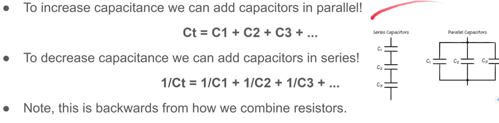

# Section 3

### Here I've got capacitors!.

- Capacitors are electronic devices that are capable to storage electrical energy and free it, kind of like a battery.
- Capacitors have 2 conductors separated with an insulator.
- Capacitors have an anode (+) and a cathode (-) poles.
- One of their uses is a decoupling capacitor, which means, it stores energy and the dissipates it back into the circuit so we can maintain a smooth flow of current.
- Adding electrical energy to the capacitor is called charging.
- Releasing the energy from the capacitor is called discharging.
- Capacitance is the ability to store energy, and is meassured in Farads.
- Capacitors store energy until they have the same voltage of the voltage source and then they get polarized  (+ || -)
- There must be a potential difference (non constant voltaje) in order to have current flowing through the capacitor for it to get charged.
- Once the capacitor is charged, no more current flows through it and it's polarized.
- Once is charged we can give it a path to release the stored energy.
- The capacitor will discharge, its voltage will be 0, it will not be polarized anymore and no more current will flow through it.

### RC time constant
- RC stands for resistance x capacitance (in seconds).
- RC = 1 time constant
- It takes 1 time constant for a capacitor to charge till 63%.
- It takes 1 time constant for a capacitor to discharge to 37%.
- After 5 time constants (5RC) the capacitor is considered fully charged or discharged and no more current will flow.

### We can increase the capacitance rather by adding more resistance (less brigth) or by increasing the capacitance (capacitors in parallel)

## Materials
- 1 100uF Capacitor
- 1 200 ohm Resistor
- 1 100K ohm Resistor
- 1 LED
- At Least 3 Jumper Wires
- A 9 Volt Battery
- Aligator Clips
- 1 Multimeter

## Wiring

### The capacitor discharges with the time

### The capacitor discharges completely with a jumper wire tied to the same line of the anode
### This happens extremely fast

## Discharging to a resistor and LED
### 5k ohm resistor and 100uF Capacitor
### The capacitor is fully charged when pushing the button,  if we release the button
### there will be a path for the capacitor to discharge and it is (capacitor->resistor->led->ground)

### The LED fades out completely in approximately  5RC (5 time constants)

### if we want to fade in the LED,  we just have to replace the jumper from vcc to the button with a 5k resistor, getting (resistor->button->capacitor) this is our charging circuit

## Longer Discharge
### 1k ohm resistor, 2 100uF Capacitor and 220uF Capacitor in parallel so we increase the capacitance
### RC = 1000 ohms * 0.00042F   =>  5RC = 2.1 seconds
### The LED fades out in approximately 2.1 seconds
