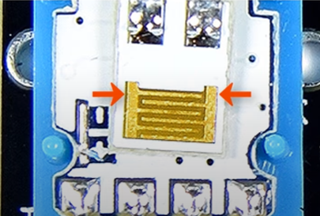
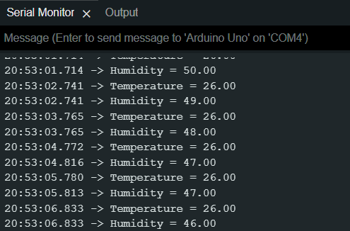

# Arduino

### Here I've got DHT11 Humidity and Temperature Sensor.

- The DHT11 sensor is an electronic device that detects humidity in the air and temperature.
- It has a three pins, one for vcc, one for signal and another one for ground.
- Eventhough the pin for signal is tied to a digital pin of the arduino, the device itself converts the analogic signal of the humidity or temperature to a digital signal.
- This device provides temperature readings in degrees celsius, the conversion is performed inside the sensor.
- The sensor has a microcontroller with a termistor and it calculates temperature.

- The humidity is provided as relative humidity which means Percentage of moisture in the air.
- Inside the case of the sensor it has 2 electrodes.
- This sensor measures the humidity by detecting the electrical resistance between two electrodes already mentioned.
- The electrodes are separated by a material that absorbs moisture and the conductivity increases when water is absorved
- High relative humidity causes low resistance between the electrodes
- Low relative humidity causes high resistance between the electrodes

##

- Connect the signal pin of the sensor to a digital pin of the arduino.
- Download this library for the dht sensor https://github.com/RobTillaart/Arduino/tree/master/libraries/DHTlib
- Copy and paste the .h and .cpp files into a new folder into C:/User/Documents/Arduino/libraries/< the folder name >.

## Materials
- 1 Arduino
- 1 DHT11 With PCB
- At Least 5 Jumper Wires
- 1 Breadboard
##

## Hook Up

 

## Credits 
* Yt Circuit Basics How to Use a DHT11 Humidity Sensor on the Arduino - Ultimate Guide to the Arduino #38
* Arduino Tutorial 50: How to Connect and Use the DHT11 Temperature and Humidity Sensor