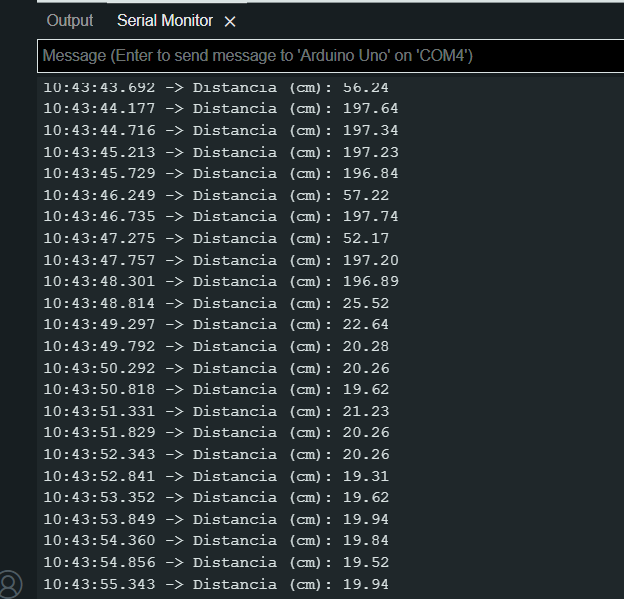

# Arduino

### Here I've got a Ultrasonic Distance Sensor

- vcc and ground are provided by arduino's pins.
- Connect the vcc terminal of the ultrasonic distance sensor to vcc in the breadboard.
- Connect the ground terminal of the ultrasonic distance sensor to ground in the breadboard.
- Connect the trigger terminal of the sensor to the PWM 9 pin of the arduino and set it as OUTPUT.
- Connect the echo terminal of the sensor to the PWM 10 pin of the arduino and set it as INPUT.
- Calibrate the sensor by setting the trigger to LOW, then HIGH for 10 microseconds and again to low.
- Read the pulse of the ultrasonic wave with pulseIn and the echo pin.
- Convert that value to distance d=s*t.

## Materials
- 1 Arduino
- 1 Ultrasonic Distance Sensor
- At Least 8 Jumper Wires
- 1 Breadboard
##

## Hook Up

